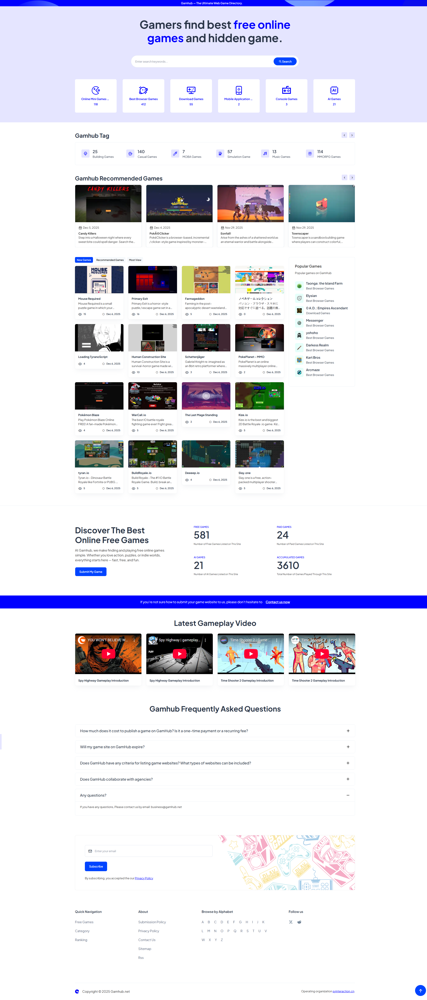

  

# gamhub-game-directory
Gamhub is a curated directory of top browser games, featuring one-domain indie titles and major mini-game portals for fast, high-quality online play.

# GameHub – Web Game Discovery & Directory

GameHub is an independent web-based game discovery platform that helps players find, explore, and play high-quality browser games across different genres and platforms.

🌐 Website: https://gamhub.net

---

## 🎮 What is GameHub?

GameHub focuses on **curated web games** rather than downloadable titles.  
It provides an organized and lightweight way for users to discover games that can be played instantly in the browser.

Core goals:
- Reduce friction between players and games
- Highlight quality browser-based games
- Provide structured navigation by genre and category

---

## 🧩 Key Features

- 📂 Curated game directory
- 🕹️ Instant-play web games (no installation)
- 🏷️ Category & tag-based navigation
- 🔍 Simple and fast browsing experience
- 🌍 Global-accessible platform

---

## 🗂️ Game Categories (Examples)

- Action
- Puzzle
- Strategy
- Arcade
- Simulation
- Casual
- Multiplayer (Web-based)

More categories are continuously added and refined.

---

## 🔗 Data Source & Updates

Games listed on GameHub are sourced from:
- Publicly available web games
- Developer submissions
- Community recommendations

The platform prioritizes:
- Playability
- Accessibility
- Clear game descriptions

---

## 📖 Related Documentation

- Game directory structure overview  
- Category & tagging logic  
- Submission and update workflow (planned)

Documentation will evolve as the platform grows.

---

## 🤝 Contributing

Currently, this repository serves as:
- Public documentation
- Project overview
- Reference point for the GameHub platform

Contribution guidelines may be added in the future.

---

## Platform Preview

## 📬 Contact & Links

- Official Website: https://gamhub.net
- Project Homepage: https://gamhub.net

If you are a developer or content creator interested in web games, feel free to explore the platform.

---

## 📌 License

This repository is for documentation and informational purposes.
